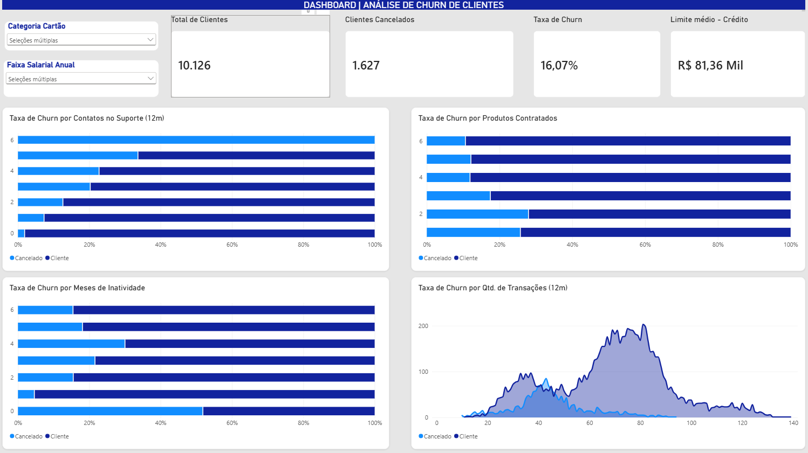

# 📊 Análise e Dashboard de Churn de Clientes (Python & Power BI)

Este projeto apresenta uma solução completa para análise de retenção e cancelamento (*Churn Rate*) de clientes de cartão de crédito. A estratégia combinou o tratamento e a exploração inicial dos dados via **Python (Pandas)** no Google Colab com a criação de um dashboard executivo e interativo no **Power BI**.

---

## 🖼️ Visão Geral do Dashboard

---

## 🎯 Objetivo do Projeto
Identificar os principais fatores que levam os clientes ao cancelamento e fornecer uma ferramenta visual e intuitiva para orientar ações preventivas da gestão financeiro-operacional.

---

## 🐍 Etapa 1: Limpeza e Análise Exploratória em Python (Pandas)
No notebook desenvolvido no Google Colab, a base bruta passou por um processo de tratamento para garantir a integridade e alta performance dos dados:

* **Manipulação de Dados:** Leitura e estruturação da base de clientes utilizando a biblioteca `pandas`.
* **Higienização de Dados:** Tratamento e remoção de colunas sem valor analítico direto (como IDs de clientes com `tabela.drop`) e eliminação de registros nulos (`tabela.dropna()`).
* **Diagnóstico Inicial:** Mapeamento da distribuição entre clientes ativos e cancelados e avaliação preliminar de variáveis operacionais.

---

## 📊 Etapa 2: Visualização Executiva no Power BI
Com a base tratada, o painel foi desenvolvido no Power BI aplicando conceitos de **UX/UI e Storytelling com Dados**:

* **KPIs Estratégicos (Topo):**
  * **Total de Clientes:** 10.126
  * **Clientes Cancelados:** 1.627
  * **Taxa de Churn:** 16,07%
  * **Limite Médio de Crédito:** R$ 81,36 Mil
* **Filtros Dinâmicos Laterais:** Segmentação interativa por Categoria do Cartão e Faixa Salarial Anual.
* **Visuais Narrativos:** Gráficos de barras empilhadas 100% para análise proporcional e gráfico de área para volumetria de transações ao longo do tempo.

---

## 💡 Principais Insights de Negócio
1. **Impacto do Atendimento (Suporte):** Há uma correlação direta entre contatos no suporte e cancelamento — clientes com 4 a 6 chamados apresentam as maiores proporções de Churn.
2. **Padrão de Transações:** A distribuição mostra que o grupo de clientes cancelados se concentra na faixa mais baixa de volume de transações nos últimos 12 meses (entre 20 e 50 transações).
3. **Inatividade:** Monitoramento preventivo é crucial, visto que clientes inativos nos primeiros meses já representam parcela relevante de perdas.

---

## 🛠️ Tecnologias Utilizadas
* **Python:** Pandas (Limpeza, Tratamento e ETL)
* **Google Colab:** Ambiente de desenvolvimento do script Python
* **Power BI Desktop:** Modelagem de dados, DAX, Design de Interface e Storytelling
* **CSV:** Fonte de dados

---

## 📁 Estrutura do Repositório
* `dashboard-churn-clientes.pbix`: Arquivo do Power BI.
* `analise_churn_python.ipynb`: Notebook Python com o script de tratamento e análise exploratória.
* `base_dados_churn.csv`: Base de dados utilizada no projeto.
